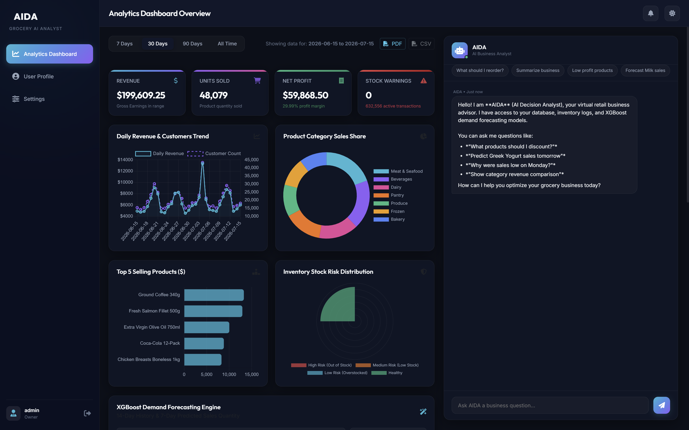
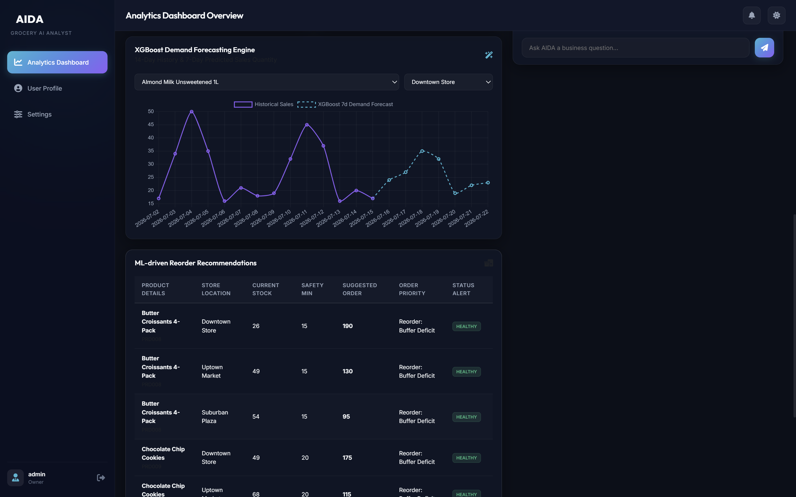
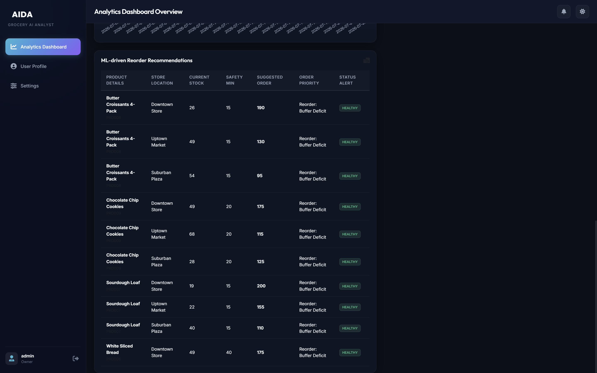
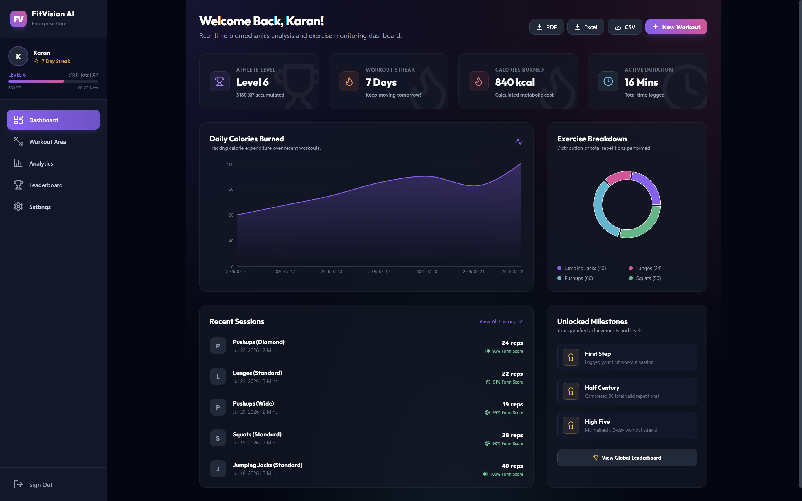
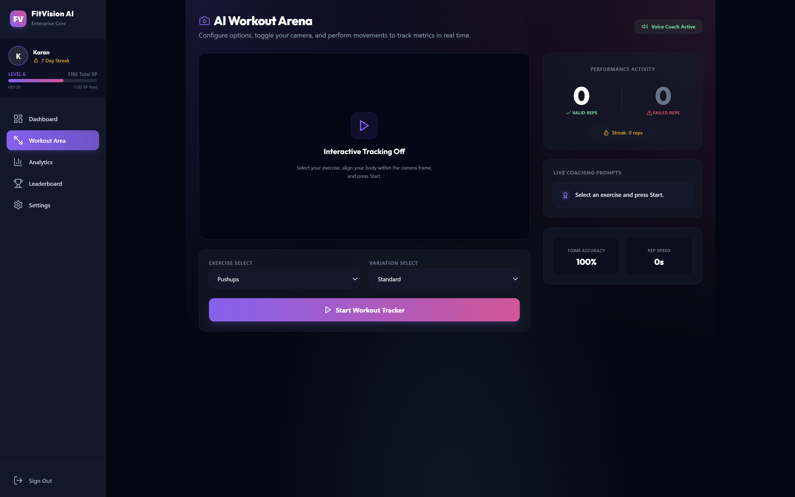
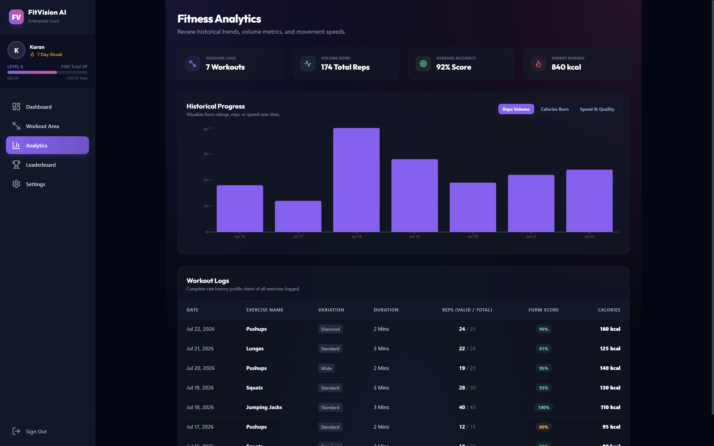
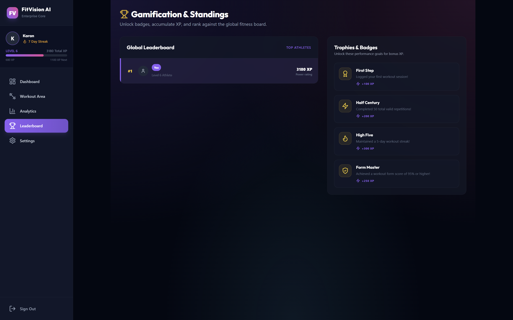
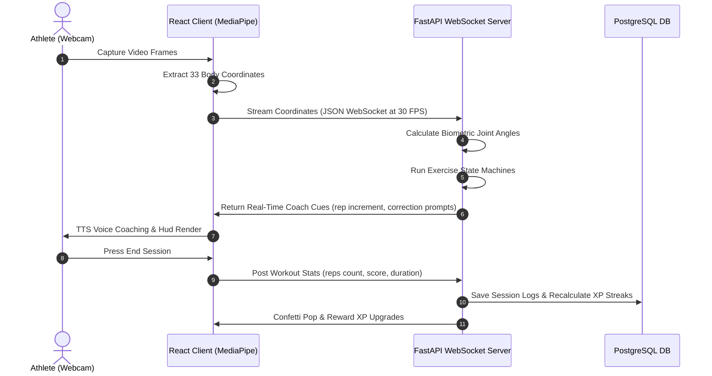
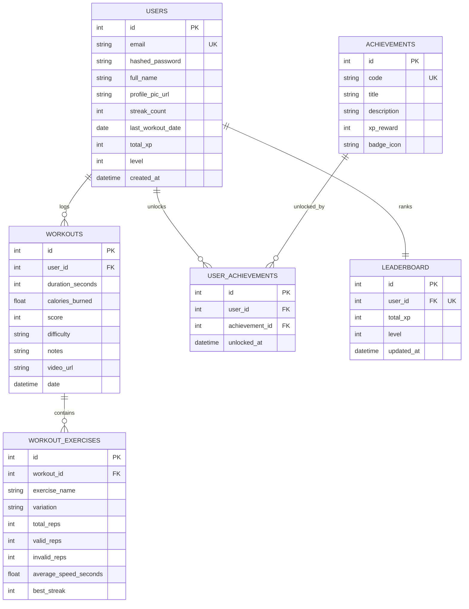

# ⚡ FitVision AI ⚡

<p align="center">
  <b>Biometrics Tracking & Fitness Analytics SaaS Platform</b>
</p>

<p align="center">
  
  
  
  
  
  
</p>

---

FitVision AI is a production-ready, enterprise-grade AI fitness monitoring SaaS platform. It leverages browser-based MediaPipe body landmark tracking to stream biomechanics telemetry over WebSockets to a Python FastAPI backend. The backend executes state machine tracking rules to detect exercises (specifically pushups and all their 9 variations), count repetitions, evaluate postures, and stream real-time coaching feedback.

---

## 📸 Project Showcase

Below are the interface previews showing the athlete dashboard, real-time biomechanics tracking, performance analytics, and account configuration.

<table align="center">
  <tr>
    <td align="center" width="50%">
      <b>🔒 Secure Authentication & Onboarding</b><br />
      
    </td>
    <td align="center" width="50%">
      <b>📊 Athlete Dashboard & Progress Hub</b><br />
      
    </td>
  </tr>
  <tr>
    <td align="center" width="50%">
      <b>⚙️ Exercise Configuration & Settings</b><br />
      
    </td>
    <td align="center" width="50%">
      <b>🏆 Gamified Community Leaderboard</b><br />
      
    </td>
  </tr>
  <tr>
    <td align="center" width="50%">
      <b>🎥 Real-Time Camera Pose Estimation</b><br />
      
    </td>
    <td align="center" width="50%">
      <b>📈 Interactive Analytics & Biometric Charts</b><br />
      
    </td>
  </tr>
  <tr>
    <td align="center" colspan="2">
      <b>📄 PDF & CSV Performance Report Generation</b><br />
      
    </td>
  </tr>
</table>

---

## 🛠 Tech Stack

*   **Frontend**: React (Vite) + TypeScript + TailwindCSS + Recharts
*   **Backend**: FastAPI (Python 3.10) + SQLAlchemy + WebSockets + Uvicorn
*   **AI Engine**: MediaPipe Pose (Web SDK coordinate extraction) + Headless OpenCV
*   **Database**: PostgreSQL (Dockerized)
*   **Reporting**: ReportLab (PDF) + Pandas (Excel / CSV sheets exports)
*   **Deployment**: Docker + Docker Compose + GitHub Actions CI/CD pipeline

---

## 🏗 System Architecture Flow



---

## 📊 Database Schema & ER Model



---

## ⚡ Real-Time Tracking State Rules (Biometrics Engine)

Our AI rules engine in `ai_service.py` evaluates joint angles to track repetitions:
*   **Push-ups**: Monitors left/right elbow angle (Shoulder-Elbow-Wrist). Rep begins when angles drop from >150° to <90° (down stage), and increments when returning to >145° (up stage).
    *   *Diamond Push-ups*: Wrists horizontal distance is < 40% of shoulder width.
    *   *Wide Push-ups*: Wrists horizontal distance is > 140% of shoulder width.
    *   *Pike Push-ups*: Hips angle is bent (< 120°) throughout the movement.
*   **Squats**: Evaluates knee angle (Hip-Knee-Ankle). Rep triggers down when knee drops < 100°, and completes when knees straighten > 160°.
*   **Plank**: Validates static hold straightness (Shoulder-Hip-Ankle angle > 155°). Counts hold time in seconds.

---

## 🚀 Installation & Local Running

### Running with Docker Compose (Recommended)

1.  Clone the repository and locate the root workspace folder:
    ```bash
    cd FitVisionAI
    ```
2.  Duplicate `.env.example` as `.env` and fill values:
    *   **On Windows (cmd/PowerShell):**
        ```powershell
        copy .env.example .env
        ```
    *   **On macOS/Linux:**
        ```bash
        cp .env.example .env
        ```
3.  Launch the Docker containers:
    ```bash
    docker-compose up --build
    ```
4.  Open the web browser:
    *   **Frontend Client**: [http://localhost:5173](http://localhost:5173)
    *   **Backend OpenAPI Documentation**: [http://localhost:8000/docs](http://localhost:8000/docs)

---

### Running Locally (Without Docker)

#### 1. Setup Database
Ensure you have a PostgreSQL server running locally, create a database named `fitvision`, and update the `DATABASE_URL` in your `.env` file.

#### 2. Run Backend
1.  Navigate to the backend directory:
    ```bash
    cd backend
    ```
2.  Initialize virtual environment and install requirements:
    ```bash
    python -m venv venv
    
    # On Windows:
    .\venv\Scripts\activate
    
    # On macOS/Linux:
    source venv/bin/activate
    
    pip install -r requirements.txt
    ```
3.  Launch the FastAPI server:
    ```bash
    uvicorn app.main:app --reload --host 127.0.0.1 --port 8000
    ```

#### 3. Run Frontend
1.  Navigate to the frontend directory:
    ```bash
    cd ../frontend
    ```
2.  Install dependencies:
    ```bash
    npm install
    ```
3.  Launch Vite:
    ```bash
    npm run dev
    ```

---

## 🧪 Testing

We use Pytest to run isolated API and unit tests mock-loading SQLite in memory.
1.  Enter backend directory:
    ```bash
    cd backend
    ```
2.  Run Pytest suite:
    ```bash
    pytest
    ```

